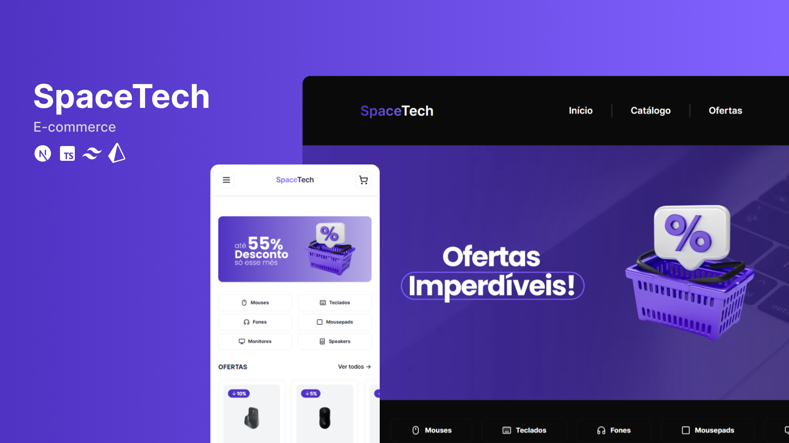

# SpaceTech

## 🛒 Sobre

SpaceTech é um e-commerce de equipamentos de tecnologia, o usuário pode logar/deslogar com a conta do Google, trocar o tema para dark ou light mode, listar os produtos por categoria, visualizar produtos em oferta, ver detalhes do produto, adicionar ou remover do carrinho, no carrinho tem a soma de produtos com ou sem desconto, visualizar pedidos finalizados.

## 🔨 Funcionalidades

- [x] Autenticação com Google
- [x] Visualização de todos os produtos
- [x] Visualização de produtos por categoria
- [x] Visualização de produtos em oferta
- [x] Ver detalhes do produto
- [x] Adicionar produto ao carrinhos
- [x] Remover produto do carrinho
- [x] Soma dos produtos com ou sem desconto
- [x] Finalizar pedido
- [x] Visualização de pedidos finalizados
- [x] Trocar tema para dark/light

## 🧪 Ferramentas

- [Next.js](https://nextjs.org/)
- [TypeScript](https://www.typescriptlang.org/)
- [Prisma](https://www.prisma.io/)
- [TailwindCSS](https://tailwindcss.com/)
- [shadcn/ui](https://ui.shadcn.com/)
- [clsx](https://www.npmjs.com/package/clsx)
- [date-fns](https://date-fns.org/)

## 🚀 Deploy

Você pode acessar o projeto através [desse link](https://spacetech.vercel.app/)

---

Desenvolvido com 💜 por <a href="https://www.linkedin.com/in/palomarodrigs" target="_blank">Paloma Rodrigues</a>

